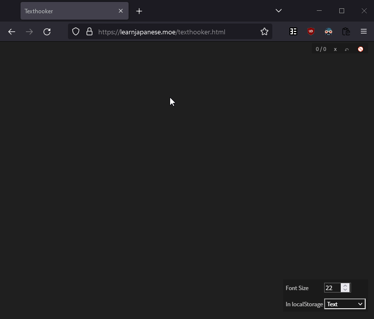

# Lap Clipboard Inserter

A browser extension whose purpose is to repetitively insert the system clipboard's content into a page.

## Demonstration


This example uses the [TheMoeWay texthooker page](https://learnjapanese.moe/texthooker.html) in addition to this extension for displaying all the changes that happen to the system clipboard. The Visual Novel in the gif is [H2O -FOOTPRINTS IN THE SAND-](https://vndb.org/v473).

Used alongside a texthooker, e.g. [Textractor](https://github.com/Artikash/Textractor), it's possible to capture all the text of a Visual Novel, useful to track how many characters you read at that day and to easily create [Anki](https://apps.ankiweb.net/) cards. See the [TMW explanation of this process](https://learnjapanese.moe/vn/) for more details.

## Instructions

Click the icon of this extension to toggle its functionality.



If the addon is turned off, it won't execute any script or use your browser resources.

## Differences from the original Clipboard Inserter

This extension has the following differences from the [original Clipboard Inserter](https://github.com/kmltml/clipboard-inserter):

1. Support of Manifest V3.
2. More optimized.
3. Easier to enter in contact with the developer.

## Installation

### Firefox

You can download it here: [Firefox Browser ADD-ONS](https://addons.mozilla.org/en-US/firefox/addon/lap-clipboard-inserter/)

Note: this version uses Manifest V2 because Firefox doesn't support Manifest V3 yet. The code can be found under the `manifest-v2` branch.

### Chrome

I am currently waiting until this [feature](https://bugs.chromium.org/p/chromium/issues/detail?id=1339382) gets stabilized to push to the Chrome Web Store.

## Building

Building the extension requires `npm`. To build it, clone this repo and run:

```shell
npm install
# Build the extension without generating source map files and with optimizations
npm run build
# Build the extension for debugging purposes
npm run dev
```

After this, you can use a program like `web-ext` to run or test the extension.

### Firefox

If you are going to use this in Firefox, you also need to substitute all references of `chrome` to `browser` in `dist/bundle.js`, for example:

```shell
cd dist
sed -i 's/chrome/browser/g' bundle.js
```

## Acknowledgements

- This project is inspired by the [original Clipboard Inserter](https://github.com/kmltml/clipboard-inserter), by [Kamil Tomala](https://github.com/kmltml).
- The icon used by this extension was designed by [Freepik - Flaticon](https://www.flaticon.com/free-icons/clipboard) and can be found in [this page](https://www.flaticon.com/free-icon/paste_748035).

## License

This program is free software: you can redistribute it and/or modify it under the terms of the GNU General Public License as published by the Free Software Foundation, either version 3 of the License, or (at your option) any later version. See [LICENSE](LICENSE) for more details.
